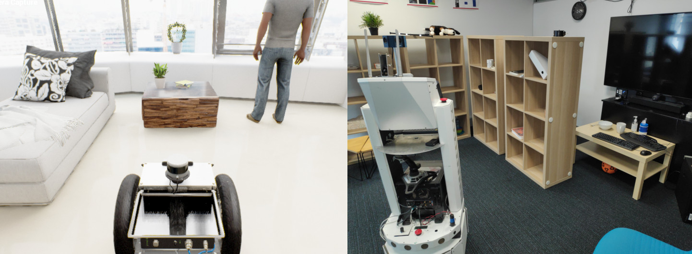

**NOTE: this software is part of the BenchBot software stack, and not intended to be run in isolation. For a working BenchBot system, please install the BenchBot software stack by following the instructions [here](https://github.com/roboticvisionorg/benchbot).**

# BenchBot Robot Controller



The BenchBot Robot Controller is the layer of the BenchBot software stack that handles all direct interactions with the underlying robot platform. It is designed to be run directly on the robot platform, whether that is a real robot or on the same host as a simulator. This allows optimal performance for tight control loops in actuation, like those used for moving the robot between poses. It also significantly simplifies the [BenchBot Supervisor](https://github.com/roboticvisionorg/benchbot_supervisor), allowing it to focus solely on HTTP communications & configurations without the burden of ROS.

## Installing & running the BenchBot Robot Controller

The BenchBot robot controller is a ROS package: it contains a ROS node which communicates downstream to low-level components, a HTTP server for upstream communication, & a Python-based process manager for automated management of low-level components. The package is installed like any other ROS package:

```
u@pc:~$ git clone https://github.com/roboticvisionorg/benchbot_robot_controller
u@pc:~$ ln -sv "$(pwd)/benchbot_robot_controller <CATKIN_WS>/src/"
u@pc:~$ cd <CATKIN_WS> && catkin_make
```

Once installed, the ROS node (which contains everything including the HTTP server & process manager) is run via:

```
u@pc:~$ rosrun benchbot_robot_controller benchbot_robot_controller
```

Note that configuration for the controller is not provided at runtime, it is instead provided on demand via the `/configure` HTTP route described below. This facilitates swapping of configurations on-the-fly where desired.

## Interacting with the BenchBot Robot Controller

The BenchBot Robot Controller class defined in `src/benchbot_robot_controller.py` exposes a RESTful HTTP API for getting data about robot state, & managing the lifecycle of running processes for the underlying platform. They are currently mostly implemented as `GET` requests, which should probably be tweaked in the future.

The RESTful HTTP API includes the following commands:

| Request Route | Response JSON Format | Description |
| --------------|:---------------:|-------------|
| `/`           | <pre>`Hello, I am the BenchBot robot controller`</pre> | Arbitrary response to confirm connection |
| `/config/`    | <pre>{... current config ...}</pre> | Returns the current configuration of the controller |
| `/config/<config>`    | <pre>{... <config> subset of config ...}</pre> | Returns a subset of the current configuration of the controller based on the name `<config>` |
| `/connections/<connection>` | <pre>{... connection response ...}</pre> | Calls connection named `<connection>`, returning the response once all callbacks are complete |
| `/is_collided` | <pre>{'is_collided': True\|False}</pre> | Goes to `True` once the robot has collided with an obstacle (never returns to false after that point) |
| `/is_dirty` | <pre>{'is_dirty': True\|False}</pre> | Goes to `True` once the robot has moved for the first time |
| `/is_finished` | <pre>{'is_finished': True\|False}</pre> | Returns `False` while the task can still be continued (e.g. while there are still poses left in a passive actuation mode trajectory) |
| `/is_running` | <pre>{'is_running': True\|False}</pre> | Returns `True` if all simulator ROS topics are alive |
| `/next` | <pre>{'next_success': True\|False}</pre> | Kills any currently running simulator & starts the *next* simulated environment from the list provided on startup |
| `/reset` | <pre>{reset_success: True\|False}</pre> | Kills the currently running simulator & restarts the *same* simulated environment |
| `/restart` | <pre>{restart_success: True\|False}</pre> | Kills the currently running simulator & restarts the *first* simulated environment |
| `/selected_env` | <pre>{'name': string, 'number': int}</pre> | Returns the currently running environment `name`, and its `number` in the list of environments provided to `benchbot_run` when started |

